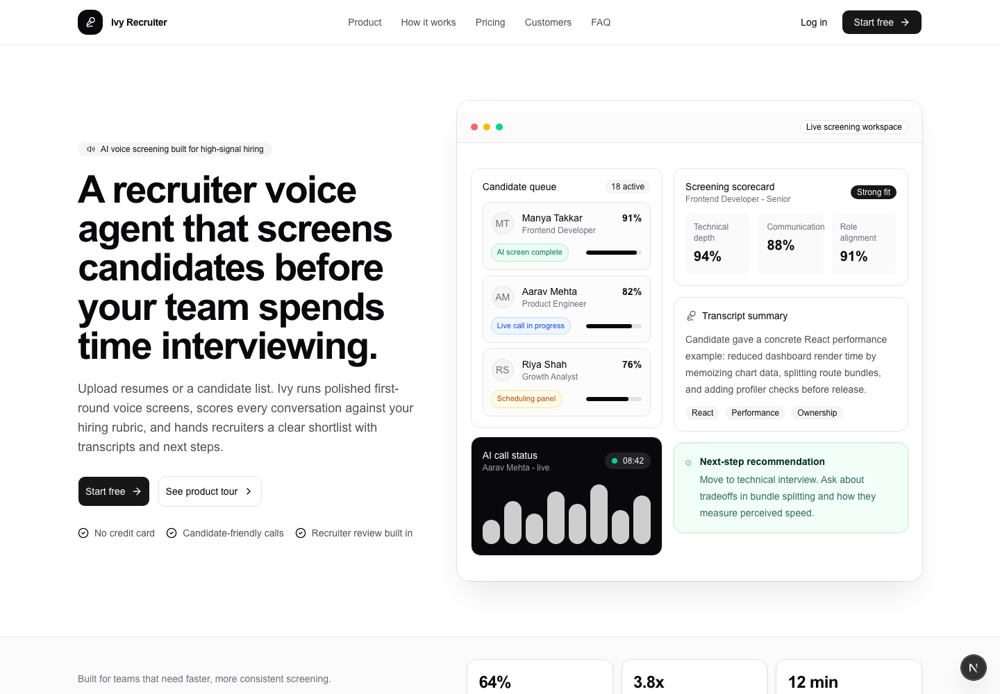
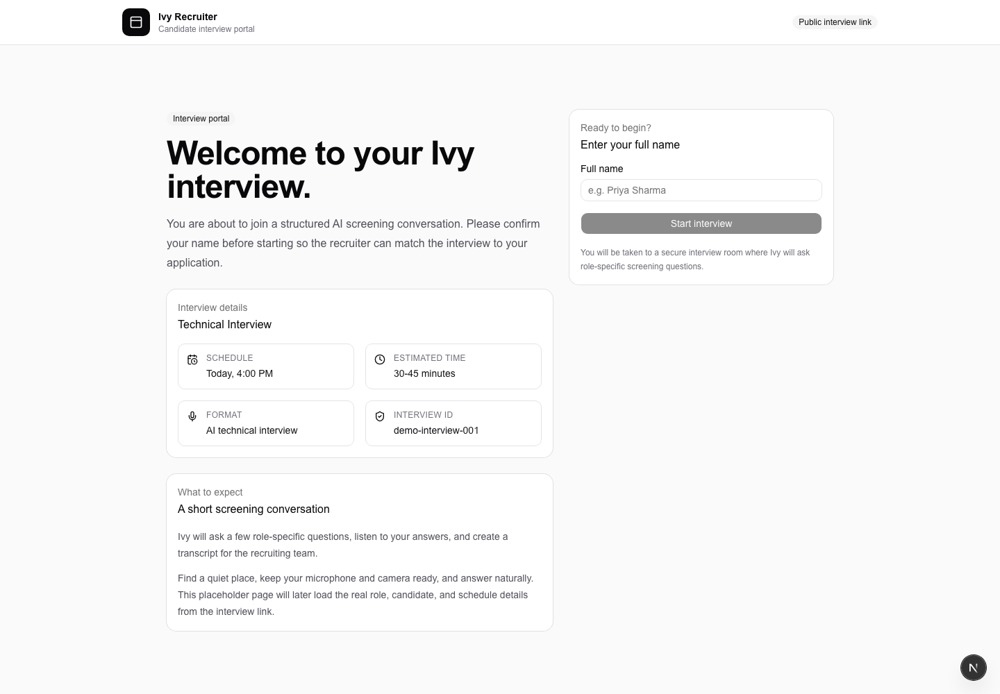

# Ivy AI Recruiter

Ivy is an AI-assisted recruiting workspace for managing jobs and candidates, matching talent to open roles, sending interview invitations, conducting adaptive voice interviews, and reviewing evidence-based scorecards and transcripts.

The application combines a recruiter dashboard with a public candidate interview portal. Recruiters configure the voice agent once, then Ivy applies those settings to interview length, prompts, voice synthesis, invitation emails, evaluation, alerts, and regional formatting.



## Core Features

- **Live recruiter dashboard** with active roles, candidate totals, interview progress, recent results, and average scores.
- **Candidate management** with manual entry, resume upload, AI-assisted parsing, search, profile pages, and resume downloads.
- **Job management** with AI-generated descriptions, role details, screening rubrics, job status controls, and configurable defaults.
- **Candidate matching** with role-fit scores, reasons, gaps, next-step recommendations, and multi-candidate selection.
- **Transactional invitations** through Brevo with editable AI drafts, interview categories, branded email content, and unique interview links.
- **Adaptive voice interviews** using Groq for question generation and evaluation, Murf for speech synthesis, and browser speech/audio capture.
- **Interview operations** grouped by job, with invited/completed views, search, category filters, status, and result percentages.
- **AI analysis pages** with overall score, recommendation, rubric evidence, strengths, concerns, next steps, and full transcripts.
- **Recruiter settings** for question counts, silence timeout, voice, locale, style, prompts, closing message, branding, notifications, score alerts, job defaults, and timezone.
- **Authentication and user sync** through Clerk, with application users persisted in Neon Postgres.

## Candidate Interview Portal

Every successful invitation creates an interview session and a candidate-facing URL. The interview category controls the configured question count and interview behavior.



## Technology Stack

| Area | Technology |
| --- | --- |
| Application | Next.js 16, React 19, TypeScript |
| Styling | Tailwind CSS 4, Base UI, shadcn components, Lucide icons |
| Authentication | Clerk |
| Database | Neon Postgres, Drizzle ORM, Drizzle Kit |
| Language model | Groq Chat Completions |
| Voice synthesis | Murf Falcon 2 streaming API |
| Email | Brevo transactional email API |
| Resume parsing | `pdf-parse`, `mammoth`, plain-text extraction |

## Project Structure

```text
ivy/
├── app/
│   ├── api/                    # Candidate, job, interview, settings, and webhook APIs
│   ├── dashboard/              # Authenticated recruiter workspace
│   │   ├── candidates/         # Candidate list, profiles, and resume workflow
│   │   ├── interviews/         # Interview tracking and AI analysis
│   │   ├── jobs/               # Jobs, matching, and invitation workflow
│   │   └── settings/           # Recruiter and voice-agent settings
│   └── interview/[interviewId] # Public candidate interview portal and room
├── components/ui/              # Shared application controls
├── drizzle/                    # SQL migrations and Drizzle snapshots
├── lib/
│   ├── auth/                   # Clerk-to-database user synchronization
│   ├── db/                     # Drizzle client and schema
│   └── interview/              # Recruiter agent-settings resolution
├── public/screenshots/         # README product screenshots
└── types/                      # Local TypeScript declarations
```

## Prerequisites

- Node.js 20 or later
- npm
- A Neon Postgres database
- A Clerk application
- A Groq API key
- A Murf API key with Falcon 2 access
- A verified Brevo transactional-email sender

## Local Setup

1. Clone the repository and enter the Next.js application directory:

```bash
git clone git@github.com:reallymanya/Ivy-AI-Recruiter.git
cd Ivy-AI-Recruiter/ivy
```

2. Install dependencies:

```bash
npm install
```

3. Create `.env` and add the required configuration:

```dotenv
DATABASE_URL="postgresql://..."

NEXT_PUBLIC_CLERK_PUBLISHABLE_KEY="pk_..."
CLERK_SECRET_KEY="sk_..."
NEXT_PUBLIC_CLERK_SIGN_IN_URL="/sign-in"
NEXT_PUBLIC_CLERK_SIGN_UP_URL="/sign-up"
NEXT_PUBLIC_CLERK_SIGN_IN_FALLBACK_REDIRECT_URL="/dashboard"
NEXT_PUBLIC_CLERK_SIGN_UP_FALLBACK_REDIRECT_URL="/dashboard"
CLERK_WEBHOOK_SECRET="whsec_..."

GROQ_API_KEY="gsk_..."
MURF_API_KEY="..."

BREVO_API_KEY="xkeysib-..."
BREVO_SENDER_EMAIL="verified-sender@example.com"
BREVO_SENDER_NAME="Ivy Recruiting Team"

NEXT_PUBLIC_APP_URL="http://localhost:3001"
```

4. Apply database migrations:

```bash
npm run db:migrate
```

5. Start the development server on port 3001:

```bash
npm run dev -- --port 3001
```

Open [http://localhost:3001](http://localhost:3001).

## Environment Variables

| Variable | Purpose |
| --- | --- |
| `DATABASE_URL` | Neon Postgres connection string used by Drizzle. |
| `NEXT_PUBLIC_CLERK_PUBLISHABLE_KEY` | Public Clerk frontend key. |
| `CLERK_SECRET_KEY` | Private Clerk server key. |
| `CLERK_WEBHOOK_SECRET` | Verifies Clerk user webhooks. |
| `GROQ_API_KEY` | Generates jobs, invitation drafts, adaptive questions, and evaluations. |
| `MURF_API_KEY` | Lists voices, previews voices, and streams interview speech. |
| `BREVO_API_KEY` | Sends candidate invitations and recruiter result notifications. |
| `BREVO_SENDER_EMAIL` | Verified Brevo sender address. |
| `BREVO_SENDER_NAME` | Default transactional-email sender name. |
| `NEXT_PUBLIC_APP_URL` | Base URL embedded in interview and analysis links. |

Never commit `.env` or production credentials. The repository ignores environment files by default.

## Database Workflow

The schema lives in `lib/db/schema.ts`. Generated migrations and snapshots live in `drizzle/`.

```bash
# Generate a migration after changing the schema
npm run db:generate

# Apply committed migrations
npm run db:migrate

# Open Drizzle Studio
npm run db:studio
```

Use committed migrations for shared and production environments. Reserve `db:push` for deliberate local development because it synchronizes the schema directly rather than preserving a migration history.

## Main Workflows

### Add and Match Candidates

1. Add a candidate manually or upload a PDF, DOCX, or text resume.
2. Review and correct parsed fields before saving.
3. Open a job and run candidate matching.
4. Select one, multiple, or all matched candidates.

### Send Interview Invitations

1. Choose Screening, Technical, or HR Final interview.
2. Generate and edit the invitation draft.
3. Send through Brevo.
4. Ivy creates a unique interview session and records the successful invitation.

### Conduct and Evaluate Interviews

1. The candidate opens the public link and confirms their name.
2. Ivy asks adaptive role-specific questions using the recruiter configuration.
3. Murf speaks each question while browser audio and transcripts capture responses.
4. Groq generates an evidence-based scorecard when the interview completes.
5. The recruiter receives a notification and can review the analysis and transcript.

## Recruiter Settings

Settings are persisted per recruiter and resolved from each interview session. They control:

- Company and interviewer identity
- Murf voice, locale, and speaking style
- Question limits for each interview category
- Silence timeout and adaptive follow-ups
- Interview and evaluation instructions
- Closing message
- Email branding, subject, introduction, and reply-to
- Completion notifications and low-score threshold
- Default job location, currency, and employment type
- Dashboard and analysis timezone

The Murf voice picker intentionally presents a curated set of interview-appropriate English voices and supports an audio preview before saving.

## Application Routes

| Route | Description |
| --- | --- |
| `/` | Public Ivy product page |
| `/dashboard` | Live recruiter overview |
| `/dashboard/jobs` | Job management and matching |
| `/dashboard/candidates` | Candidate management |
| `/dashboard/interviews` | Invited and completed interview tracking |
| `/dashboard/interviews/[interviewId]` | Dedicated AI analysis and transcript |
| `/dashboard/settings` | Recruiter and voice-agent configuration |
| `/interview/[interviewId]` | Public interview joining page |
| `/interview/[interviewId]/room` | Live candidate interview room |

## Quality Checks

Run these before committing or deploying:

```bash
npm run lint
npx tsc --noEmit
npm run build
```

The production build uses Next.js with Webpack.

## Deployment Notes

Vercel is the recommended host for the Next.js application, with Neon used as a separate managed Postgres service.

- Set the Vercel root directory to `ivy` when importing the repository.
- Configure Preview and Production environment variables separately.
- Apply database migrations before sending production traffic to a new schema.
- Set `NEXT_PUBLIC_APP_URL` to the final production domain before sending invitations.
- Add the production domain and callback URLs to Clerk.
- Configure the Clerk webhook as `/api/webhooks/clerk`.
- Verify the Brevo sender and review Brevo IP-authorization settings for serverless hosting.

## Security and Privacy

- API keys remain server-side and are never returned to browser clients.
- Public interview links reference session UUIDs rather than candidate contact details.
- Recruiter pages are protected by Clerk.
- Resume contents, transcripts, scores, and reports are stored in Postgres and should be handled as confidential recruiting data.
- README screenshots use public/demo views and do not expose live candidate contact details.

## License

This repository currently has no open-source license. Add a license before distributing or accepting external contributions.
